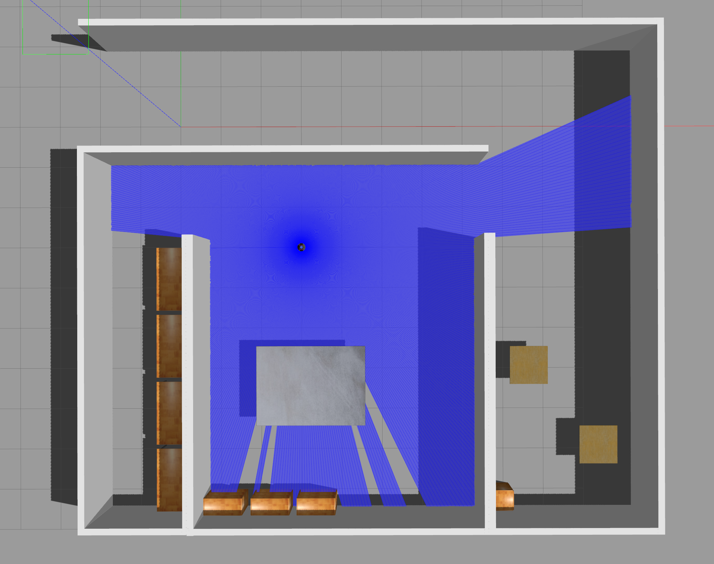
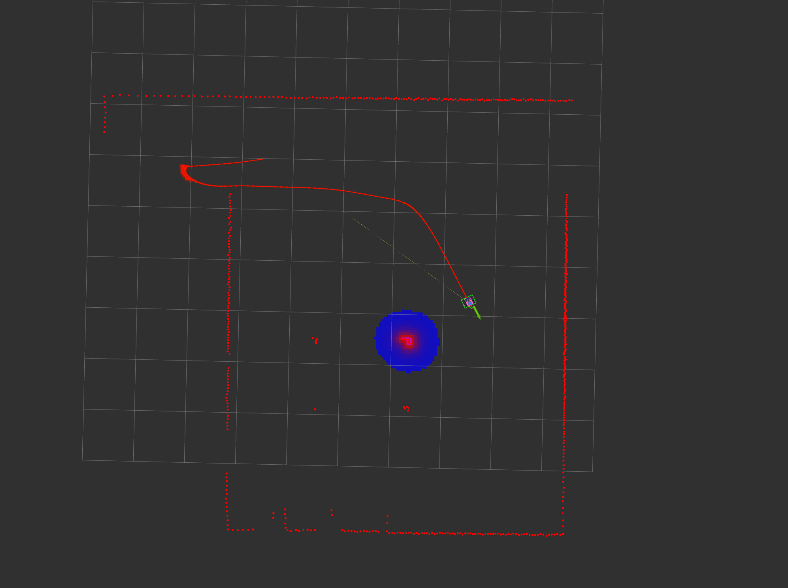

# omorobot_r1_mini_navigation

## Navigation without map (planning on the odometry frame)

```
$ roslaunch omorobot_r1_mini_bringup bringup_gazebo.launch
$ roslaunch omorobot_r1_mini_navigation bringup_odom_navigation.launch
```

<center></center>
<center></center>